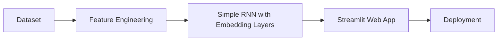

# RNN-Sentimental-Analysis

This project performs movie-review sentiment analysis on the IMDB dataset using RNNs.
### try the live demo here:

[Try the Live Demo!](https://rnn-sentimental-analysis-ysmdwlkkxao9xwcftvsfno.streamlit.app/)


## flow chart of the project


## Getting Started

Follow these steps to set up and run the project:

### 1. Create a Virtual Environment
First, create and activate a virtual environment.

```bash
# Create a virtual environment
python -m venv venv

# Activate the virtual environment
# For Windows:
venv\Scripts\activate

# For macOS/Linux:
source venv/bin/activate
```
### 2. Install Dependencies

After activating the virtual environment, install all the required libraries:
```bash
pip install -r requirements.txt
```
### 3. Run the Streamlit App
Finally, to launch the Streamlit app, run:
```bash
streamlit run main.py
```

This will open the Streamlit page in your browser tab.


